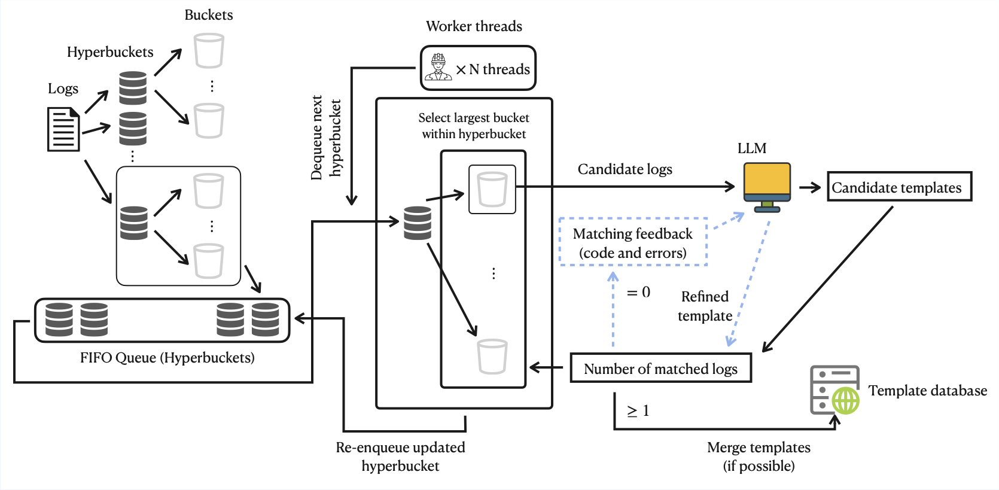

# SCULP: An Unsupervised LLM-Based Log Parser with Self-Correcting Capabilities



# 1. Quick Start
### Step 1: Environment
Run the following command to install the dependencies
```bash
conda create -n sculp python=3.8.19
conda activate sculp 

cd SCULP
pip install -r requirements.txt
```

### Step 2: Add DeepSeek API key and base url
Add your DeepSeek API key and base url by updating `./SCULP/config.py` file
```python
LLM_BASE_MAPPING = {
    "deepseek-v4-pro": [
        "deepseek-v4-pro", "https://api.deepseek.com",
        ""
    ]
}
```

> **Note:** DeepSeek has recently updated its API. The `deepseek-chat` model (formerly **DeepSeek-V3.2**, ~685B parameters) is being deprecated and is now mapped to the *non-thinking* mode of **DeepSeek-V4-Flash** (~284B parameters).  
> To faithfully reproduce the results reported in the paper, please use **DeepSeek-V4-Pro** instead.

### Step 3: Run with example Apache dataset
```commandline
bash run.sh Apache
```

#### For CTS

The [CTS template file](https://github.com/logpai/LUNAR/blob/main/datasets/CTS/CTS_full.log_templates.csv) in the LUNAR repository actually corresponds to the `EventTemplateWithHeader` field, rather than the `EventTemplate` field in the [CTS structured logs](https://github.com/logpai/LUNAR/blob/main/datasets/CTS/CTS_full.log_structured.csv).  

To ensure consistency with the evaluation, we update the CTS template file by extracting the `EventTemplate` column directly from the structured logs so that it accurately reflects the true templates used.

# 2. Run with more datasets
To experiment with more datasets, please follow the below steps:

### Step 1: Download Loghub-2.0
You can download the other datasets in LogHub2.0 from this [link](https://zenodo.org/records/8275861) and move them to `./dataset` just like the Apache dataset.

Please perform the following preprocessing step to canonicalize logs for **Apache**, **HPC**, **Hadoop**, and **Spark**, using the provided canonical template files (e.g., `Apache_full.log_templates.csv`):

```commandline
cd datasets
# Example for Hadoop
python template_2_structure.py Hadoop_full.log_templates.csv Hadoop_full.log_structured.csv
```

### Step 2: Run with all datasets
You can run the following command to evaluate on all datasets
```commandline
bash run.sh all
```


# 3. SCULP-Parallel
You can also run an efficient version SCULP-Parallel with the following steps:

### Step 1: Run with example Apache dataset
```commandline
bash run-parallel.sh Apache
```

### Step 2: Run with Loghub-2.0
After you download the Loghub-2.0 datasets, you can use the following scripts to evaluate on all datasets
```commandline
bash run-parallel.sh all
```
